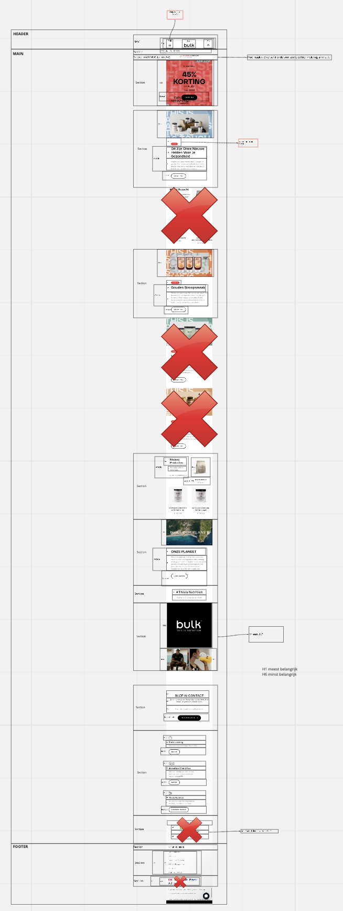
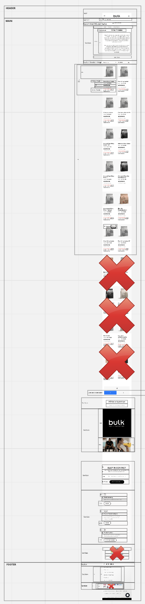

# Procesverslag
Markdown is een simpele manier om HTML te schrijven.  
Markdown cheat cheet: [Hulp bij het schrijven van Markdown](https://github.com/adam-p/markdown-here/wiki/Markdown-Cheatsheet).

Nb. De standaardstructuur en de spartaanse opmaak van de README.md zijn helemaal prima. Het gaat om de inhoud van je procesverslag. Besteedt de tijd voor pracht en praal aan je website.

Nb. Door *open* toe te voegen aan een *details* element kun je deze standaard open zetten. Fijn om dat steeds voor de relevante stuk(ken) te doen.

## Jij

uitwerken voor kick-off werkgroep

### Auteur:
Olaf Husslage

#### Je startniveau:
Blauw

#### Je focus:
Surface plane
 

## Je website

uitwerken voor kick-off werkgroep

### Je opdracht:
https://www.bulk.com/nl/

#### Screenshot(s) van de eerste pagina (small screen): 
Homepage  

#### Screenshot(s) van de tweede pagina (small screen):

Whey Proteine page 
 

## Breakdownschets (week 1)

uitwerken na afloop 2e werkgroep

### de hele pagina: 

### dynamisch deel (bijv menu): 

### wellicht nog een dynamisch deel (bijv filter): 

## Voortgang 1 (week 2)

uitwerken voor 1e voortgang

### Stand van zaken
Ik heb alleen nog maar mijn HTML geschreven en die is goed volgens Robert. Nu ga ik verder met CSS schrijven.

### Verslag van meeting
- Heading's kloppen nog niet
- Robert gaat me de maandag erna helpen met mijn code

## Voortgang 2 (week 3)

uitwerken voor 2e voortgang

### Stand van zaken
Hier dit ging goed & dit was lastig (neem ook screenshots op van delen van je website en code)

Wat niet goed ging was dat mijn grid template niet goed werkte, waardoor een paar afbeeldingen niet goed gestyled werden. Het ging hier om 3 afbeeldingen, waarbij er op de eerste rij 1 afbeelding moest komen en op de 2e rij 2 afbeeldingen. Door zelf te proberen ben ik erachter gekomen dat het lag aan dat de width per afbeelding op 100% moest staan. Dit heb ik gedaan en de afbeeldingen postioneerden zoals ik het wilde. 

Hier stond het verkeerd:

Nu staat het zo (door bij inspecteren te kijken naar de vakken in de grid template en hoe daar een afbeelding in past):

Ik heb goede code geschreven en kan verder met transities.

### Verslag van meeting
- Grid row start en end bij elementen toevoegen in een grid, om ze goed te positioneren.
- Minder classes en meer css selectoren in plaats daarvan gebruiken.
- Volgens de studentassistent ben ik goed op weg en is het wijs om met transities te beginnen (hamburger, winkelmand en zoeken)

## Toegankelijkheidstest (week 4)

uitwerken na test in 8e voortgang

### Bevindingen
Lijst met je bevindingen die in de test naar voren kwamen:

#### Kleurenblindheid-bril
Maakt niet echt verschil in of je dingen wel of niet kan lezen. Alles wat wit is ziet er alleen veel geler uit. Grijze tekst nog wel leesbaar maar wel iets moeilijker. Andere kleuren als blauw zijn veel intenser. 

Veranderingen die ik kan toepassen: zwarte tekst ipv grijze tekst gebruiken.

#### Low contrast-bril (blurry vision) 
Enige wat je nog kan lezen zijn de grote lettertypes. Kleine lettertypes en al helemaal in het grijs worden onleesbaar. 

Wat een oplossing zou kunnen doen is een modus toevoegen waarbij je in kan stellen dat lettertypes veel groter worden en wederom de grijze tekst zwart maken.

#### Hemifield loss-bril 
Het verschil met hoe je normaal ziet is niet heel groot. Er is alleen een stukje van je beeld afgesneden, maar dit is niet problematisch.

#### Elastiekje om 2 vingers 
Scrollen is echt moeilijk geworden. Je hebt bij een macbook namelijk 2 vingers nodig om te scrollen. Typen gaat nog wel.

Modus toestaan waarin je met 1 vinger kan scrollen kan dit wellicht oplossen.

#### Parkingson-nabootsing
Typen wordt bijna onmogelijk, scrollen gaat nog enigszins.

Dit is wellicht op te lossen door voice control toe te passen in je site.

#### Feedback klasgenoot nav tabben door site
- Search bar opmaak kan je misschien veranderen
- Dingen die geen buttons zijn als een a met link stylen, alleen als iets binnen een page werkt mag het alleen een button zijn
- ‘Nieuw’ niet als button
- Winkelmandje werkt nog niet dus wordt ook nog niet gepakt

#### Test met screenreader
- Hamburgermenu wordt uitgesproken als een link
- Winkelmandje heeft geen link dus wordt niet uitgesproken
- Alle teksten worden uitgesproken
- Alle links worden uitgesproken
- Images worden niet genoemd (moet ik echt fixen, anders loopt mn andere page echt in de soep.

Ik ga al deze feedback verwerken.

## Voortgang 3 (week 4)

uitwerken voor 3e voortgang

### Stand van zaken
hier dit ging goed & dit was lastig (neem ook screenshots op van delen van je website en code)

### Verslag van meeting
hier na afloop snel de uitkomsten van de meeting vastleggen

- punt 1
- punt 2
- nog een punt
- ...

## Eindgesprek (week 5)

uitwerken voor eindgesprek

### Stand van zaken
hier dit ging goed & dit was lastig (neem ook screenshots op van delen van je website en code)

### Screenshot(s)

hier screenshot(s) van je eindresultaat

## Bronnenlijst

continu bijhouden terwijl je werkt

Nb. Wees specifiek ('css-tricks' als bron is bijv. niet specifiek genoeg).

1. https://www.bulk.com/nl/
2. https://css-tricks.com/snippets/css/a-guide-to-flexbox/
3. https://codepen.io/shooft/pen/eYRdEPm
4. https://codepen.io/shooft/pen/abwLwRO
5. https://www.flaticon.com (alle icons binnen mijn footer)
6. https://developer.mozilla.org/en-US/docs/Web/HTML/Element/hr (voor lijntje tussen main en footer)
7. https://developer.mozilla.org/en-US/docs/Learn/Forms/Styling_web_forms (voor styling van forms)
8. https://stuffandnonsense.co.uk/blog/redesigning-your-product-and-website-for-dark-mode (voor dark mode)
9. https://www.flaticon.com/free-icon/loupe_622669?term=search&page=1&position=1&page=1&position=1&related_id=622669&origin=search (search icon in zoekbalk)
10. https://www.flaticon.com/free-icon/close_2089650?k=1632927769278 (kruisje sluiten van hamburgermenu)
11. https://www.w3schools.com/css/css_positioning.asp
12. https://elad.medium.com/css-position-sticky-how-it-really-works-54cd01dc2d46

